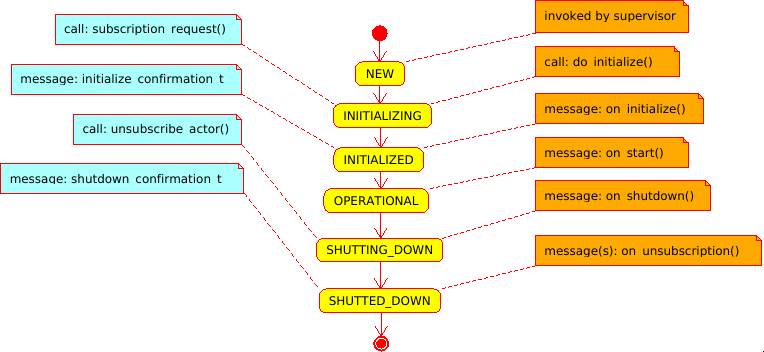

# Design & Notions

[boost-asio]: https://www.boost.org/doc/libs/release/libs/asio/ "Boost Asio"
[boost-smartptr]: https://www.boost.org/doc/libs/release/libs/smart_ptr/ "Boost Smart Pointers"
[Erlang]: https://en.wikipedia.org/wiki/Erlang_(programming_language)
[let-it-crash]: http://wiki.c2.com/?LetItCrash

`address` is runtime entity, served as subscription and delivery point. Any `message` can
be sent to an address; any `actor` can subscribe on any kind of messages on any address.
An `address` is generated by `supervisor`, address holds reference to `supervisor`.

`message` is runtime entity, which consists of destination `address` and user supplied
mutable `payload`. Message are delivered to `actors`. **The order of delivery messages
is source-actor sequenced**: if a source-`actor` generates messages `m1` and then `m2`, that
is is guaranteed that `m1` will arrive to destination earlier then `m2`. Meanwhile there
can be other messages *for the destination* from other senders. Sometimes, the approach
is named *per-sender-FIFO*. The delivery itself to an actor is *not guaranteed*, not in the
sense the `rotor` will loose it, but because the actor migth be not yet ready for it
(not subscribed), or the actor migth be no longer ready for it (i.e. already unsubscribed).
`payload` is **mutable**. It is user responsibility to allowed for an `actor` to change
a payload in a thread-safe way, but it is recommended to do modifications only
when it is known that an `actor` is single consumer of the message; if there are multiple
consumers of the the messages it is recommended not to change the message, or provide
synchronization mechanisms on the payload (discouraged, as locks/mutexes might lead to
application deadlock).

The messaging in `rotor` resembles IP protocol: it is quite simple (compared to TCP),
without delivery/strict delivery order guarantees, no streams, no timers etc., however
solid foundation of distributed actors can be build on top of `rotor`, adding only
*required guarantees*.

`actor` is runtime entity, with user-defined reaction on incoming messages. An `actor`
can send messages to other actors, as well as do interaction with with outer world (i.e.
via loop, timers, I/O etc.). The main business-logic should be written in actors.
An `actor` always is executed *in the constext* of some `supervisor`.

`supervisor` is special kind of `actor`, which encapsulates *infrastructure-logic*,
i.e. responsible for spawning/terminating actors, interaction with loop (timeouts),
and for message dispatching/delivering. All messages sent by spawned actors, are
put into outbound queue of supervisor. `supervisor` was designed to represent
sequential execution context, similar to `strand` from [boost-asio] (in fact has
`starnd` object for `rotor-boost`); in other words all messages are devivered sequentially
within the context of an `supervisor`, and it is safe to call one some actor's method
from some other actor, located on the same supervisor, if needed.

Unlike supervisors in [Erlang], the [let-it-crash] principle is not acceptable in C++,
hence it is expected that actors will perform `shutdown` procedure. It is expected
that an user will inherit `supervisor` class and write application specific reaction
on an actor shutdown. For proper `supervisor` destruction, all extenrally held
`addresses` should be destroyed.

The `system_context` is runtime environmen for supervisors, which holds `loop` or
some other context, which should be accessible in thread-safe way. When an fatal
error is encounted, it is delegated to `system_context`, which by default just prints
it to `std::cerr` and invokes `std::abort()`.

All `rotor` entities above use *intrusive pointer* approach from [boost-smartptr], with
the thread-safe atomic counters by default. If it is known, that `rotor` actors
will be used strictly on single thread, then it is possible to use faster non-atomic
counters.

## Actor states

(blue - call/messages from an actor to supervisor; yellow - actor state, orange -
call/messages from supervisor to an actor).

An actor is constructed via a `supervisor` or in some thread-safe context (i.e. when
`supervisor` is inactive). Then, within the same context the `do_initialize` method
is invoked; it performs *early initialization*, i.e. subscription to rotor-message
via the `supervisor`.

Then `supervisor` delivers a message for `on_initialize` method. By default `actor`
immediately replies to it with `initialize_confirmation` message and moving it's
state to `INITIALIZED`. Then `supervisor` delivers a message for `on_start` method,
moving actor's start to `OPERATIONAL`.

The derived class from `actor` is capable to suspend, for example, `intialization`
message; that will trigger suspension of the `start` message send by supervisor.
This is useful, when some other `actor` observes initialization of the current actor,
i.e. the initialization of 2nd actor depends on the initialization of the 1st actor, so
it is possible to have some kind of initialization chains. The "suspension"
of message is done via holding `initialization` message and NOT invoking the
`on_initialize` method of base actor until, according to the logic of the actor,
initialization is finished.

Actor shutdown is reverse process: `supervisor` sends `shutdown_request` message
(`on_shutdown`), the actor changes it's state to `SHUTTING_DOWN`, and initiates
unsubscription for all subscriptions. The `supervisor` sends back
`unsubscription_confirmation_t` to the actor; when there are no more subscriptions
actor changes state to `SHUTTED_DOWN` and sends the confirmation to the supervisor
address.

The approach makes it possible for external actors observe when observable
actor changes state (`INITIALIZED`, `OPERATIONAL`, `SHUTTING_DOWN`, `SHUTTED_DOWN`)
and react appropriately.

