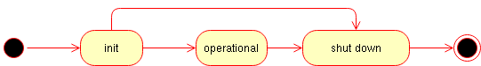

# Design & Notions

[boost-asio]: https://www.boost.org/doc/libs/release/libs/asio/ "Boost Asio"
[boost-smartptr]: https://www.boost.org/doc/libs/release/libs/smart_ptr/ "Boost Smart Pointers"
[Erlang]: https://en.wikipedia.org/wiki/Erlang_(programming_language)
[reliable]: https://en.wikipedia.org/wiki/Reliability_(computer_networking) "reliable"
[request-response]: https://en.wikipedia.org/wiki/Request%E2%80%93response
[let-it-crash]: http://wiki.c2.com/?LetItCrash
[blog-cpp-supervisors]: https://basiliscos.github.io/blog/2019/08/19/cpp-supervisors/ "Trees of Supervisors in C++"
[cpu-affinity]: https://en.wikipedia.org/wiki/Processor_affinity

**address** is runtime entity, served as subscription and delivery point. Any `message` can
be sent to an address; any `actor` can subscribe on any kind of messages on any address.
An `address` is generated by `supervisor`, address holds reference to `supervisor`.

**message** is runtime entity, which consists of destination `address` and user supplied
mutable `payload`. Message are delivered to `actors`. **The order of delivery messages
is source-actor sequenced**: if a source-`actor` generates messages `m1` and then `m2`, that
is is guaranteed that `m1` will arrive to destination earlier then `m2`. Meanwhile there
can be other messages *for the destination* from other senders. Sometimes, the approach
is named *per-sender-FIFO*. The delivery itself to an actor is *not guaranteed*, not in the
sense the `rotor` will loose it, but because the actor might be not yet ready for it
(not subscribed), or the actor might be no longer ready for it (i.e. already unsubscribed).
`payload` is **mutable**. It is user responsibility to allowed for an `actor` to change
a payload in a thread-safe way, but it is recommended to do modifications only
when it is known that an `actor` is single consumer of the message; if there are multiple
consumers of the the messages it is recommended not to change the message, or provide
synchronization mechanisms on the payload (discouraged, as locks/mutexes might lead to
application deadlock).

The messaging in `rotor` resembles IP protocol: it is quite simple (compared to TCP),
without delivery/strict delivery order guarantees, no streams, no timers etc., however
solid foundation of distributed actors can be build on top of `rotor`, adding only
*required guarantees*.

`rotor` supports [reliable] messaging via adopting [request-response] pattern: whenver
`request` message is sent timeout timer is spawn, if the `reply` isn't delivered in
time, the sender is notified about the occurred error. If the reply is sent twice
by mistake, the second reply message will be silently discarded.

**actor** is runtime entity with user-defined reaction on incoming messages. An `actor`
can send messages to other actors, as well as do interaction with with outer world (i.e.
via loop, timers, I/O etc.). The main business-logic should be written in actors.
An `actor` always is executed *in the context* of some `supervisor`.

Every `actor` has it's "main" address, used for rotor-internal messaging. In addition
it can create as many as needed address ("identities"), which can be used for
distinguishing `replies`.

**supervisor** is special kind of `actor`, which encapsulates *infrastructure-logic*,
i.e. responsible for spawning/terminating actors, interaction with loop (timeouts),
and for message dispatching/delivering. All messages sent by spawned actors, are
put into outbound queue of supervisor. `supervisor` was designed to represent
*sequential execution context*, similar to `strand` from [boost-asio] (in fact `rotor-asio`
has strand` object fo); in other words all messages are delivered sequentially
within the context of an `supervisor`, and it is safe to call one some actor's method
from some other actor, located on the same supervisor, if needed.

**locality** is rotor-specific marker of `sequential execution context`. An supervisor
might have an independent locality, i.e. execute only on its own (`strand`); or a
list of supervisors might share the same `locality`. For some event loops (i.e. other
then [boost-asio]), it it the only option. In other words it is "thread affinity"
somewhat similar to [cpu-affinity].

Supervisors might form a tree-like structure making some kind of hierarchy of responsibilities.
This allows to build a robust application via controlled degradation of its services
when leaf-actors are restarted in case of error, then their supervisors (with all actors)
are restarted and so on the error propagates until the root supervisor. The child restart
policy is user-defined for each supervisor individually. For more details see the
article [blog-cpp-supervisors].

For example, if actor `A3` is going down, the `supervisor_child` will receive a
message about it, and it might decide either to spawn `A3` again, or if restart
limit is reached, shutdown self and all other child actors `A1` and `A2`. The
`supervisor_root` will receive down message of `supervisor_child`, and the
decision to restart `supervisor_child` (with all it's children) or to shutdown self
should be made again.

Unlike supervisors in [Erlang], the [let-it-crash] principle is not acceptable in C++,
hence it is expected that actors will perform `shutdown` procedure. It is expected
that an user will inherit `supervisor` class and write application specific reaction
on an actor shutdown. For proper `supervisor` destruction, all externally held
`addresses` should be destroyed.

It should be noted, that a "crash" is actually "controlled crash", i.e. ability
of an actor to detect some non-fatal error state and notify about that to upstream
supervisor. After that the supervisor *asks* for shutdown and the actor must
*confirm* it (maybe after some delay, i.e. after asynchronous resources release).
There is no magical remedy against abnormal failures, which lead to `std::abort`
or `std::terminate`.

The **system_context** is runtime environment for supervisors, which holds `loop` or
some other context, which should be accessible in thread-safe way. When an fatal
error is encounted, it is delegated to `system_context`, which by default just prints
it to `std::cerr` and invokes `std::abort()`.

All `rotor` entities above use *intrusive pointer* approach from [boost-smartptr], with
the thread-safe atomic counters by default. If it is known, that `rotor` actors
will be used strictly on single thread, then it is possible to use faster non-atomic
counters.

## Actor lifecycle

The simplified actor lifetime is shown on the picture above. When actor is ready, it
enters into `operational` state, providing its services (i.e. starting to react on
the incoming messages).

The `init` and `shut down` actor states are similar to constructor and destructor
for an object, with one noteable exception: they are *asynchronous*. If `init`
fails, an actor does not enters into `operational` state and starts to shut down.

The real world actor lifecycle is a little bit more complicated. The freshly
instantiated actor is in `NEW` state; it does not receives any messages. In
the `INITIALIZING` state it starts plugins initialization, they subscribe
to system (rotor) messages and do other init activities, including the user
ones.

When init is finished (i.e. all plugins confirmed they are done with
initialization), an actor enters into `INITIALIZED` state. It is already
subscribed to all required user messages and ready to serve; however,
it still can wait an signal to start from it supervisor to perform
some action on demand, and only then the actor enters into `OPERATIONAL`
state. The signal does not have to come: supervisor might postpone it
(see synchronization patterns) or do not send at all, asking to shutdown
(because it was asked by its parent supervisor or some sibling actor
failed to init).

The shutdown is procedure is reverse: in `SHUTTING_DOWN` state actor
unsubscribes from all user and system messages, releases resources etc., and
when it is done, it enters into `SHUT_DOWN` state. In that state it
does not receives any messages and sooner it will be destroyed.

It is possible to hook corresponding methods from `actor_base_t` (please
note, that the `actor_base_t` methods *must* be called when overriding):

~~~{.cpp}
void actor_base_t::init_start()      // NEW           -> INITIALIZING
void actor_base_t::init_finish()     // INITIALIZING  -> INITIALIZED
void actor_base_t::on_start()        // INITIALIZED   -> OPERATIONAL
void actor_base_t::shutdown_start()  // OPERATIONAL   -> SHUTTING_DOWN
void actor_base_t::shutdown_finish() // SHUTTING_DOWN -> SHUT_DOWN
~~~

The state transitioning is usually performed via sending and receiving appropriate
messages, e.g. a supervisor sends to an actor `message::initialize_actor_t` **request**
and the actor enters into `INITIALIZING` state; when it switches to `INITIALIZED` at
state the actor sends back the initialization confirmation. That details are hidden
from user since `v0.09`.

**Supervisor** is an actor, so it has exactly the same lifecycle. It has the peculiarity,
that it waits it's children, i.e. supervisor enters into `INITIALIZING` state before
any of it's children actors, then it waits until all of its childern confirm that
they are `INITIALIZED`, and only after that the supervisor confirms that its own
initialization is accomplished (the similar procedure is done for shutdown procedure).

That reveals very important property of an actor lifecycle - it is **composeable**.
In a simple words it can be explained as the following: it makes it possible that
whole tree (hierarchy) of actors and supervisors either becames ready (`OPERATIONAL`)
or not (`SHUT DOWN`) without any special intervention from a user.

What makes it distinguishing supervisors from actors? It is the mechanism of plugins.

## Plugins

Plugins were introduced in `v0.09` to replace actors behavior, because behavior
nor actor itself can *authoritatively* answer the question whether the initialization
(shutdown) is done, because there are a lot of factors with different natures, which
affect the answer: are system subscriptions done? are user subscriptions done? are
all child actors confirmed initialization? are all acquired external resources already
released? The answer should be committed *cooperatively* and the single vote in the
role of a plugin. If a plugin says "I'm still not yet done with initialization",
then the whole actor still holds the `INITIALIZING` state; if a plugin says
"I'm failed to initialize", the whole actor state jumps into shutdown phase.

Each actor has a static (compile-time) list of plugins. They are polled for init-ready
question in the direct order, and for shutdown-ready question in the reverse order.
Once a plugin says "I'm done", the next one is polled etc.

The most important for user actor plugins are:

~~~{.cpp}
plugin::link_client_plugin_t
plugin::registry_plugin_t
plugin::resources_plugin_t
~~~

The `link_client` plugin is response for linking the current actor ("client" role)
with an other actor(s) ("server(s)"). This can be seen as "virtual TCP-connection",
i.e. making sure that "server" will outlive "client", i.e. all messages from
"client" to "server" will be eventually delivered, i.e. "server" will not spontaneously
shut self down having alive client connected to it. The "server" have to confirm
successful linkig of a "client", while "client" waiting the response confirmation
suspends its own initialization (i.e its state is `INITIALIZING`). It
should be noted, that actors linking is performed by actor addresses only,
i.e. "client" and "server" actors might belong to different threads, supervisors,
localities or event loops.

The `registry` plugin is the continued development of the `link_client` plugin. It
allows for "server" to register self in the "registry" (special actor, shipped
with `rotor`), and for "client" to discover "server" address via some symbolic
name (string) and then link to it (using, `link_client`, of course). This makes
it possible to encapsulate actors dependencies (i.e. to work I need "servcieA"
and "serviceB") as well as export actors services (i.e. once I'm working
I provide "serviceC").

The `resources` plugin is very specific one, as it allows to actor know that to
continue initialization (or shutdown) it needs to acquire/release external
(non-`rotor`) resources. For example, it covers the cases like: "before my actor
starts, it needs to open TCP connector to remote side and perform successful
authorization", i.e. it suspends initialization (shutdown) until some external
events occur.

## Miscellaneous topics

### Contract and its violation

It is absolutely correct to **fail initialization** because an actor will be
asked to shutdown, probably with up-scaling the problem; however **fail shutdown**
for `rotor` is violation of the contract, similar to an exception in destructor
in C++. What can the micro framework do in that situation? Out of the box
it delegates the issue to the `system_context_t` which default implementation
is to print the error and invoke `std::termiate`.

You can override the `on_error` method and hope, that it will continue to work.
The most likely it will, however, there will be a memory leak. The *rotor part*
of the leak in the failed to shutdown actor still can be handled via cleaning
internal rotor resources (see `tests/actor_test.cpp` the `force_cleanup()`
method how to do that). Still the most likely there are non-rotor leaked resources,
which have to be released too. So, if you are routing this way, you are on
very very very shaky ground near UB, and the advice not to go here at all.

If a client-actor refuses to `unlink` in time, when server-actor asked it
(because it was asked to shut down), it is also violation of the contract.

If you meeting the issue, you should tune (shutdown) timeouts for your actors
to give them enough breath to finish activities they are doing. For example,
as the (parent) supervisor shutdowns after all its children are shut down,
then the parent supervisor shutdown timeout *should be greater* then
the corresponding timeout of any of its children. Probably, the easiest way
to start is to use everywhere some fixed, but large enough, timeout (e.g. `100ms`)
everywhere, and only later, if the problem occurs, tune individual timeouts
on demand.

It is recommended to launch code under memory sanitizer tool like `valgrind`
to make sure everything is correctly cleaned.
