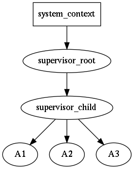
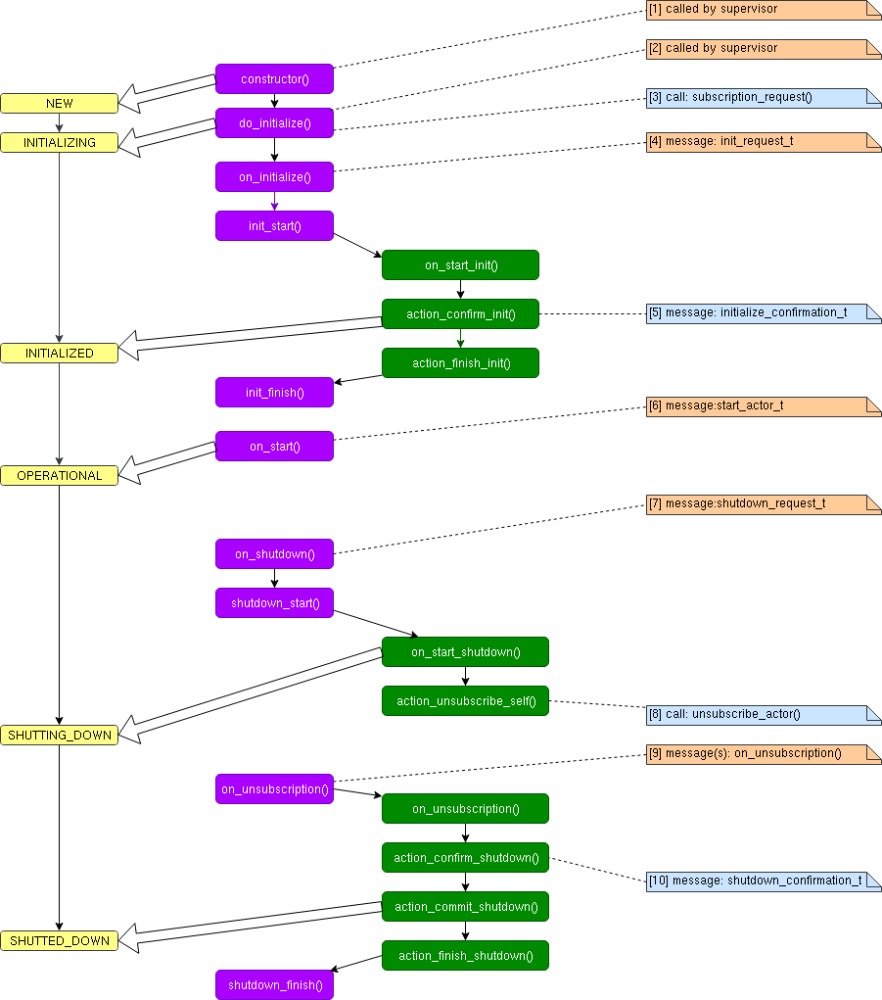

# Design & Notions

[boost-asio]: https://www.boost.org/doc/libs/release/libs/asio/ "Boost Asio"
[boost-smartptr]: https://www.boost.org/doc/libs/release/libs/smart_ptr/ "Boost Smart Pointers"
[Erlang]: https://en.wikipedia.org/wiki/Erlang_(programming_language)
[reliable]: https://en.wikipedia.org/wiki/Reliability_(computer_networking) "reliable"
[request-response]: https://en.wikipedia.org/wiki/Request%E2%80%93response
[let-it-crash]: http://wiki.c2.com/?LetItCrash
[blog-cpp-supervisors]: https://basiliscos.github.io/blog/2019/08/19/cpp-supervisors/ "Trees of Supervisors in C++"
[cpu-affinity]: https://en.wikipedia.org/wiki/Processor_affinity

**address** is runtime entity, served as subscription and delivery point. Any `message` can
be sent to an address; any `actor` can subscribe on any kind of messages on any address.
An `address` is generated by `supervisor`, address holds reference to `supervisor`.

**message** is runtime entity, which consists of destination `address` and user supplied
mutable `payload`. Message are delivered to `actors`. **The order of delivery messages
is source-actor sequenced**: if a source-`actor` generates messages `m1` and then `m2`, that
is is guaranteed that `m1` will arrive to destination earlier then `m2`. Meanwhile there
can be other messages *for the destination* from other senders. Sometimes, the approach
is named *per-sender-FIFO*. The delivery itself to an actor is *not guaranteed*, not in the
sense the `rotor` will loose it, but because the actor might be not yet ready for it
(not subscribed), or the actor might be no longer ready for it (i.e. already unsubscribed).
`payload` is **mutable**. It is user responsibility to allowed for an `actor` to change
a payload in a thread-safe way, but it is recommended to do modifications only
when it is known that an `actor` is single consumer of the message; if there are multiple
consumers of the the messages it is recommended not to change the message, or provide
synchronization mechanisms on the payload (discouraged, as locks/mutexes might lead to
application deadlock).

The messaging in `rotor` resembles IP protocol: it is quite simple (compared to TCP),
without delivery/strict delivery order guarantees, no streams, no timers etc., however
solid foundation of distributed actors can be build on top of `rotor`, adding only
*required guarantees*.

`rotor` supports [reliable] messaging via adopting [request-response] pattern: whenver
`request` message is sent timeout timer is spawn, if the `reply` isn't delivered in
time, the sender is notified about the occurred error. If the reply is sent twice
by mistake, the second reply message will be silently discarded.

**actor** is runtime entity with user-defined reaction on incoming messages. An `actor`
can send messages to other actors, as well as do interaction with with outer world (i.e.
via loop, timers, I/O etc.). The main business-logic should be written in actors.
An `actor` always is executed *in the context* of some `supervisor`.

Every `actor` has it's "main" address, used for rotor-internal messaging. In addition
it can create as many as needed address ("identities"), which can be used for
distinguishing `replies`.

**supervisor** is special kind of `actor`, which encapsulates *infrastructure-logic*,
i.e. responsible for spawning/terminating actors, interaction with loop (timeouts),
and for message dispatching/delivering. All messages sent by spawned actors, are
put into outbound queue of supervisor. `supervisor` was designed to represent
*sequential execution context*, similar to `strand` from [boost-asio] (in fact `rotor-asio`
has strand` object fo); in other words all messages are delivered sequentially
within the context of an `supervisor`, and it is safe to call one some actor's method
from some other actor, located on the same supervisor, if needed.

**locality** is rotor-specific marker of `sequential execution context`. An supervisor
might have an independent locality, i.e. execute only on its own (`strand`); or a
list of supervisors might share the same `locality`. For some event loops (i.e. other
then [boost-asio]), it it the only option. In other words it is "thread affinity"
somewhat similar to [cpu-affinity].

Supervisors might form a tree-like structure making some kind of hierarchy of responsibilities.
This allows to build a robust application via controlled degradation of its services
when leaf-actors are restarted in case of error, then their supervisors (with all actors)
are restarted and so on the error propagates until the root supervisor. The child restart
policy is user-defined for each supervisor individually. For more details see the
article [blog-cpp-supervisors].

For example, if actor `A3` is going down, the `supervisor_child` will receive a
message about it, and it might decide either to spawn `A3` again, or if restart
limit is reached, shutdown self and all other child actors `A1` and `A2`. The
`supervisor_root` will receive down message of `supervisor_child`, and the
decision to restart `supervisor_child` (with all it's children) or to shutdown self
should be made again.

Unlike supervisors in [Erlang], the [let-it-crash] principle is not acceptable in C++,
hence it is expected that actors will perform `shutdown` procedure. It is expected
that an user will inherit `supervisor` class and write application specific reaction
on an actor shutdown. For proper `supervisor` destruction, all externally held
`addresses` should be destroyed.

It should be noted, that a "crash" is actually "controlled crash", i.e. ability
of an actor to detect some non-fatal error state and notify about that to upstream
supervisor. After that the supervisor *asks* for shutdown and the actor must
*confirm* it (maybe after some delay, i.e. after asynchronous resources release).
There is no magical remedy against abnormal failures, which lead to `std::abort`
or `std::terminate`.

The **system_context** is runtime environment for supervisors, which holds `loop` or
some other context, which should be accessible in thread-safe way. When an fatal
error is encounted, it is delegated to `system_context`, which by default just prints
it to `std::cerr` and invokes `std::abort()`.

All `rotor` entities above use *intrusive pointer* approach from [boost-smartptr], with
the thread-safe atomic counters by default. If it is known, that `rotor` actors
will be used strictly on single thread, then it is possible to use faster non-atomic
counters.

## Actor lifecycle

(yellow - actor state, purple - actor methods, green - behavior methods,
light blue - call/messages from an actor to supervisor; yellow - actor state,
orange - call/messages from supervisor to an actor).

**Short story**: if you need customization, override `init_start()`, when your
initialization (i.e. possible asynchronous resources acquisition) is finished
call `init_start()`. For simple post-init (possibly synchronous) actions override
`init_finish()`. Likewise, for suspending shutdown override `shutdown_start()`
and call it later, once your resources will be (asynchronously) released. For
simple post-shutdown (possibly synchronous) actions, override `shutdown_finish()`

**Long story**. An actor is constructed via a `supervisor` or in some
thread-safe context (i.e. when `supervisor` is inactive). Then, within the same
context the `do_initialize` method is invoked; it performs *early initialization*,
i.e. subscription to rotor-message via the `supervisor`. The default behavior
is created and plugged.

Then `supervisor` delivers a message for `on_initialize` method. By default `actor`
calls records the init-message and calls `init_start`, which in its turn
delegates initialization sequence to the behavior. The actor's behavior
replies with confirmation to the init-message request and sets actor's state
to `INITIALIZED`. Once the supervisor receives init-confirmation it sends
`start_actor_t` messages, which, after receiving, advances actor's start
to `OPERATIONAL`.

It is possible to "suspend" initialization by overriding `init_start()` method.
For example it is possible to send messages to other actors, wait their replies,
and if all is OK, continue/commit the initialization by calling `init_start()`
of the base class. The `init_start()` method is good for asynchronous acquisition
of resources, i.e. opening ports, connecting to other hosts etc.

Subscriptions to the additional local actor addresses can be performed
here (if you need subscription confirmations before `on_start`, do subscribe
*before* calling `init_start()`). If the actor subscribes to the external
addresses, then, probably to avoid races, it should wait subscription
confirmations and only then confirm initialization by calling `init_start()`.

Note, however, that init-message is a **request**, i.e. it is timeout-supervised;
the default supervisor behavior will ask for shutdown the actor in the
case of init timeout.

The `init_finish()` will be invoked as the last step of the initialization.

The shutdown procedure goes in similar way: after receiving shutdown-message,
it is recorded and `shutdown_start()` is invoked. Override it to suspend
(postpone) actor shutdown procedure, and call it once actor will be ready,
i.e. additional messages can be send to other actors and their responses
can be waited, and only then shutdown can be continued.

After starting shutdown procedure actor unsubscribes itself from all
associated addresses, so most likely it will be not able to receive
any other (user-defined) messages.

As with init, the shutdown message is a **request**, i.e. it is timeout-supervised;
the default supervisor behavior will delegate the error to `system_context`, which
by default will abort the application. If the reaction should be tuned,
the custom supervisor behavior should be plugged.

After unsubscription from all addresses, the behavior sends shutdown-confirmation,
sets the actors status to `SHUTTED_DOWN` and then `shutdown_finish()` is called.

In the `shutdown_finish()` is the final method called by `rotor`. For example,
external addresses should be released to avoid memory leaks.

## Supervisor lifecycle

Generally supervisor's lifecycle is specialization of actors lifecycle. Supervisor
is considered initialized when all it's children actors are initialized, i.e.
it waits until all already created children confirm their initialization.
The default policy (`supervisor_policy_t::shutdown_self`) specifies, that if
something is wrong with a child initialization, then the supervisor will shutdown
self (and all it's children). Once all children confirmed initialization their
supervisor also confirms that (i.e. moves it's state from `INITIALIZING`
to `INITIALIZED`). All children actors created in `OPERATIONAL` supervisor state
are outside of the described behavior.

The shutdown procedure is opposite: a supervisor waits all it's children confirm
shutdown, and only then the supervisor shuts down self.
